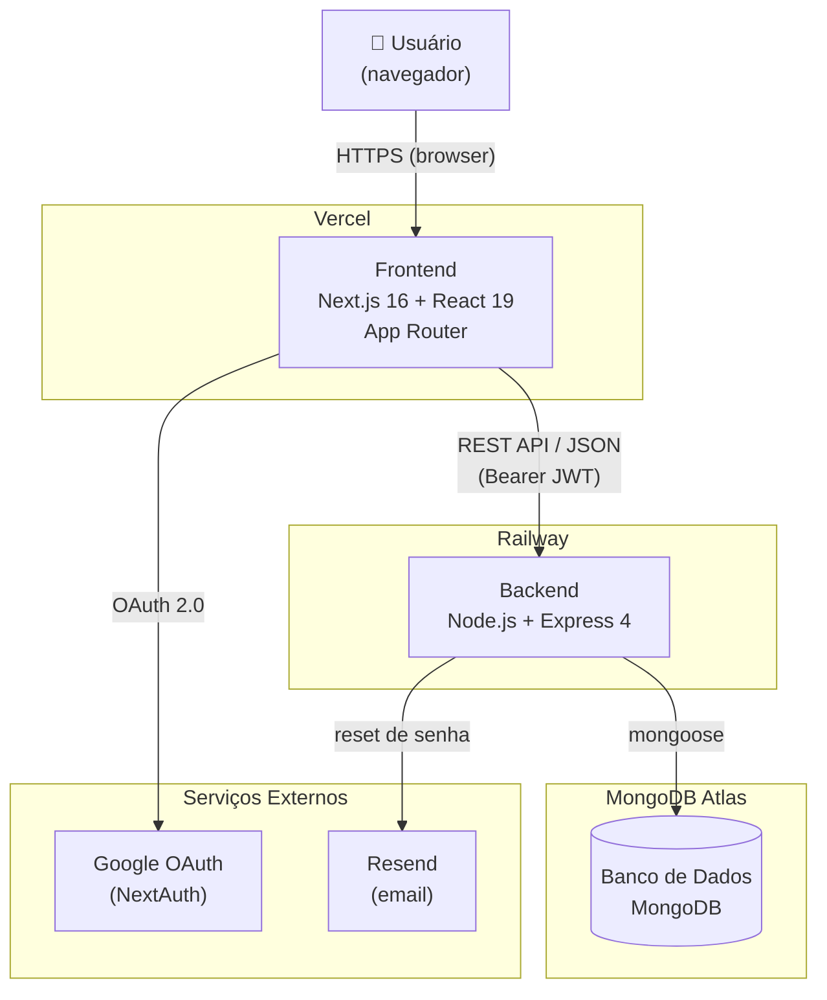

# Arquitetura — Estúdio Vitá

## 1. Visão Geral

O **Estúdio Vitá** é um sistema web de gestão para estúdio de pilates. Ele permite cadastrar pacientes, agendar sessões, registrar pagamentos e gerenciar os equipamentos da sala (Cadillac, Reformer, Cadeira, Barrel). O sistema distribui automaticamente os equipamentos entre os pacientes de cada horário, evitando que um paciente use o mesmo equipamento da aula anterior — com possibilidade de ajuste manual.

---

## 2. Arquitetura em Alto Nível



| Peça | Onde roda | Papel |
|---|---|---|
| **Frontend** | Vercel | Interface do usuário — páginas React renderizadas no browser |
| **Backend** | Railway | API REST — regras de negócio, autenticação, acesso ao banco |
| **MongoDB Atlas** | Cloud (Atlas) | Persistência de todos os dados da aplicação |
| **Google OAuth** | Google Cloud | Login social via NextAuth.js |
| **Resend** | SaaS | Envio de emails transacionais (recuperação de senha) |

---

## 3. Stack Técnica

| Camada | Tecnologia | Versão |
|---|---|---|
| Frontend framework | Next.js (App Router) | 16.2.9 |
| UI | React | 19.0.0 |
| Backend framework | Express.js | 4.19.2 |
| ODM (banco) | Mongoose | 8.5.0 |
| Banco de dados | MongoDB Atlas | — |
| Autenticação social | NextAuth.js + Google OAuth | — |
| Tokens de sessão | JWT (jsonwebtoken) | 9.0.2 |
| Hash de senhas | bcryptjs | 2.4.3 |
| Email transacional | Resend | 6.14.0 |
| Segurança HTTP | Helmet | 7.1.0 |
| Rate limiting | express-rate-limit | 7.4.0 |
| Logging HTTP | Morgan | 1.10.0 |
| Deploy frontend | Vercel | — |
| Deploy backend | Railway | — |

---

## 4. Estrutura de Pastas

```
pilates-studio/
│
├── backend/
│   ├── server.js                        # Entry point: conecta o banco e sobe o servidor
│   ├── scripts/
│   │   └── seedAdmin.js                 # Script pontual para criar o admin inicial
│   └── src/
│       ├── app.js                       # Configura Express, CORS, Helmet, rotas e middlewares
│       ├── config/
│       │   └── db.js                    # Conexão com o MongoDB Atlas via Mongoose
│       ├── models/                      # Schemas do MongoDB
│       │   ├── Appointment.js           # Agendamento (paciente, data, equipamento, manualEquipment)
│       │   ├── Equipment.js             # Equipamento cadastrado no estúdio
│       │   ├── Patient.js               # Paciente (nome, telefone, ativo/inativo)
│       │   ├── Payment.js               # Pagamento (valor, método, status)
│       │   └── User.js                  # Usuário do sistema (admin/recepcionista, local/Google)
│       ├── controllers/                 # Lógica de cada domínio
│       │   ├── authController.js        # Login, signup, Google OAuth, reset de senha
│       │   ├── appointmentController.js # CRUD de agendamentos
│       │   ├── scheduleController.js    # Rodízio automático de equipamentos por dia/semana
│       │   ├── equipmentController.js   # CRUD de equipamentos
│       │   ├── patientController.js     # CRUD de pacientes + histórico de equipamentos
│       │   ├── paymentController.js     # CRUD de pagamentos
│       │   └── userController.js        # Listagem, aprovação e remoção de usuários
│       ├── routes/                      # Mapeamento de endpoints para controllers
│       │   ├── authRoutes.js            # /api/auth/*
│       │   ├── appointmentRoutes.js     # /api/appointments/*
│       │   ├── scheduleRoutes.js        # /api/schedule/today | /:date | /week
│       │   ├── equipmentRoutes.js       # /api/equipment/*
│       │   ├── patientRoutes.js         # /api/patients/*
│       │   ├── paymentRoutes.js         # /api/payments/*
│       │   └── userRoutes.js            # /api/users/*
│       ├── middleware/
│       │   ├── authMiddleware.js        # protect (valida JWT) + authorize (valida role)
│       │   └── errorMiddleware.js       # Handler global de erros e 404
│       └── utils/
│           ├── equipmentRotation.js     # Algoritmo de rodízio de equipamentos por slot
│           ├── generateToken.js         # Geração de JWT
│           └── protectedAccounts.js     # Define o email do admin principal (imutável)
│
└── frontend/
    ├── next.config.js
    ├── app/                             # App Router do Next.js
    │   ├── layout.js                    # Layout global + providers (Auth, Session)
    │   ├── globals.css                  # Design system (variáveis CSS, estilos base)
    │   ├── page.js                      # Redireciona / → /dashboard ou /login
    │   ├── login/page.js                # Login local + botão Google
    │   ├── signup/page.js               # Auto-cadastro (conta fica pendente até aprovação)
    │   ├── forgot-password/page.js      # Solicita link de recuperação por email
    │   ├── reset-password/page.js       # Redefine senha via token do link
    │   ├── dashboard/page.js            # Resumo geral (pacientes, agendamentos, pagamentos)
    │   ├── patients/
    │   │   ├── page.js                  # CRUD de pacientes
    │   │   └── [id]/history/page.js     # Histórico de equipamentos por paciente
    │   ├── appointments/page.js         # Agendamentos + rodízio dia/semana + override manual
    │   ├── payments/page.js             # Registro e histórico de pagamentos
    │   ├── equipment/page.js            # Gestão de equipamentos (admin only)
    │   ├── users/page.js                # Aprovação e gestão de usuários (admin only)
    │   └── api/auth/[...nextauth]/
    │       └── route.js                 # Handler NextAuth (callback do Google OAuth)
    ├── components/
    │   ├── Navbar.js                    # Barra de navegação
    │   ├── ProtectedRoute.js            # HOC que bloqueia acesso sem autenticação
    │   └── NextAuthSessionProvider.js   # Provider do NextAuth para o App Router
    ├── context/
    │   └── AuthContext.js               # Contexto global de autenticação (token, user, logout)
    └── lib/
        ├── api.js                       # Wrapper do fetch com tratamento de erros e JWT
        └── authOptions.js               # Configuração do NextAuth (Google → troca por JWT próprio)
```

---

## 5. Fluxo de Dados — Exemplo: Agendar uma Sessão

```
1. Recepcionista preenche o formulário em /appointments
   └─ Seleciona paciente, data/hora, duração

2. frontend/lib/api.js
   └─ POST /api/appointments  (com Bearer JWT no header)

3. backend: authMiddleware.protect
   └─ Decodifica o JWT, busca o usuário no MongoDB
   └─ Injeta req.user na requisição

4. backend: appointmentController.createAppointment
   └─ Valida campos obrigatórios (paciente, data)
   └─ Confirma que o paciente existe e está ativo
   └─ Salva o agendamento com equipment: null

5. frontend recarrega a view de dia
   └─ GET /api/schedule/2026-06-19

6. backend: scheduleController.buildDaySchedule
   └─ Busca todos os agendamentos do dia
   └─ Para cada paciente, consulta o último equipamento usado em aula concluída
   └─ Agrupa por slot de horário
   └─ Para cada slot, chama equipmentRotation.assignEquipmentsToSlot:
       - Tenta até 50 shuffles aleatórios
       - Regra: cada paciente recebe um equipamento diferente do seu último
       - Regra: sem dois pacientes no mesmo slot usando o mesmo equipamento
       - Fallback: se impossível satisfazer a regra de não-repetição, prioriza evitar conflito
   └─ Salva o equipamento atribuído em cada Appointment no banco
   └─ Retorna o schedule montado com patientName, equipment, status

7. frontend renderiza a tabela
   └─ Exibe badge colorido com o nome do equipamento por paciente/horário
   └─ Dropdown de override manual disponível em cada linha
```

**Override manual:** se a recepcionista mudar o equipamento pelo dropdown, o frontend faz `PUT /api/appointments/:id` com `{ equipment: "Reformer" }`. O backend salva o valor e marca `manualEquipment: true`. Nas próximas chamadas ao schedule, o controller detecta que `equipment` já está preenchido e não sobrescreve.

---

## 6. Funcionalidades Principais

### Autenticação e Usuários
- Login local (email + senha com bcrypt) e login via Google OAuth
- Auto-cadastro público cria conta com status `pending` — um admin precisa aprovar antes do acesso
- Admin pode criar contas diretamente (já ativas) e definir o papel
- Recuperação de senha por email (link com token SHA-256, expira em 1h, enviado via Resend)
- Rate limiting em todas as rotas públicas de autenticação
- Conta `priscillacwb@gmail.com` é o admin principal — não pode ser removida nem ter o papel alterado

### Papéis (roles)

| Papel | Acesso |
|---|---|
| `admin` | Tudo: pacientes, agendamentos, pagamentos, equipamentos, usuários |
| `recepcionista` | Pacientes, agendamentos, pagamentos, listagem de equipamentos (sem criar/remover) |

### Gestão de Pacientes
- Cadastro com nome, telefone, email, data de nascimento e observações médicas
- Ativação/inativação (paciente inativo não pode ser agendado)
- Histórico completo de equipamentos usados por paciente

### Agendamento com Rodízio de Equipamentos
- 5 equipamentos padrão: **Cadillac**, **Reformer**, **Chair 1**, **Chair 2**, **Barrel**
- Rodízio automático: nenhum paciente repete o equipamento da sua última sessão concluída
- Override manual por agendamento: dropdown mostra só equipamentos livres no horário + o atual
- Visualização por dia e por semana
- Status de cada sessão: `agendado`, `concluído`, `cancelado`, `não compareceu`

### Pagamentos
- Registro de pagamentos por paciente com valor, método (pix, cartão, dinheiro etc.) e status
- Edição e exclusão restritas ao papel `admin`

---

## 7. Variáveis de Ambiente

> Os valores reais **nunca** devem ser commitados. Configure-os nos painéis do Vercel e do Railway.

### Backend (Railway)

```
MONGO_URI              # Connection string do MongoDB Atlas
JWT_SECRET             # Chave secreta para assinar os tokens JWT
JWT_EXPIRES_IN         # Tempo de vida do token (ex: 1d)
CORS_ORIGIN            # URL do frontend no Vercel (sem barra final)
INTERNAL_API_SECRET    # Segredo compartilhado entre frontend e backend para o callback Google
RESEND_API_KEY         # Chave de API do Resend
RESEND_FROM_EMAIL      # Endereço de remetente dos emails
FRONTEND_URL           # URL do frontend (usada no link de reset de senha)
PORT                   # Porta do servidor (Railway define automaticamente)
NODE_ENV               # production
```

### Frontend (Vercel)

```
NEXT_PUBLIC_API_URL    # URL base da API do Railway (ex: https://…railway.app/api)
NEXTAUTH_URL           # URL pública do frontend no Vercel
NEXTAUTH_SECRET        # Chave secreta do NextAuth
GOOGLE_CLIENT_ID       # Client ID do Google OAuth (Google Cloud Console)
GOOGLE_CLIENT_SECRET   # Client Secret do Google OAuth
INTERNAL_API_SECRET    # Mesmo valor configurado no backend
```

---

## 8. Como Rodar Localmente

```bash
# 1. Clone o repositório
git clone https://github.com/KSKluc4/pilates-studio.git
cd pilates-studio

# 2. Instale as dependências do backend
cd backend
npm install

# 3. Crie o arquivo de variáveis do backend
cp .env.example .env
# Edite backend/.env com suas credenciais locais

# 4. Suba o backend
npm run dev          # nodemon na porta 5000

# 5. Em outro terminal, instale as dependências do frontend
cd ../frontend
npm install

# 6. Crie o arquivo de variáveis do frontend
cp .env.example .env.local
# Edite frontend/.env.local com NEXT_PUBLIC_API_URL=http://localhost:5000/api e demais chaves

# 7. Suba o frontend
npm run dev          # Next.js na porta 3000
```

Acesse `http://localhost:3000`. O banco de dados local pode ser um cluster gratuito do MongoDB Atlas ou uma instância local.

---

## 9. Deploy em Produção

| Serviço | Plataforma | URL |
|---|---|---|
| Frontend | Vercel | https://pilates-studio-three.vercel.app |
| Backend | Railway | https://pilates-studio-production-355d.up.railway.app |

O deploy é acionado automaticamente a cada push na branch `master`.

> **Atenção:** os arquivos `.env` e `.env.local` estão no `.gitignore` e **nunca chegam ao GitHub**. Isso significa que todas as variáveis de ambiente listadas acima precisam ser configuradas manualmente:
>
> - **Vercel:** Project Settings → Environment Variables
> - **Railway:** Serviço → Variables
>
> Se `NEXT_PUBLIC_API_URL` não estiver configurado no Vercel, o frontend usará o fallback `http://localhost:5000/api` e todos os requests falharão em produção com o erro "Não foi possível conectar ao servidor".
